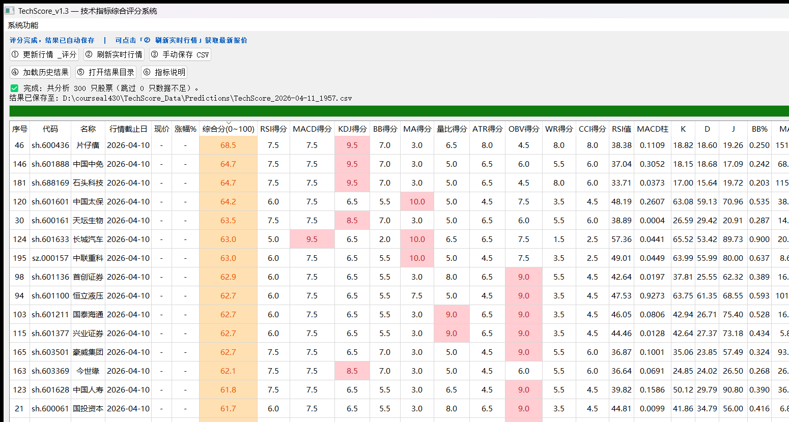
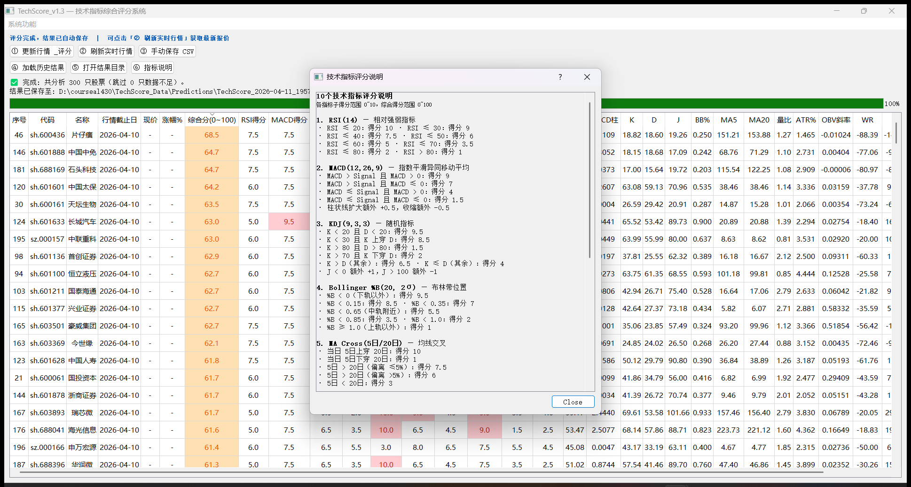

# TechScore Stock Analyzer

> 基于10个技术指标的A股综合评分系统  
> A daily technical-indicator based stock scoring system for A-share market.


---

## ⚠️ 重要声明

**本项目纯属个人学术研究与技术学习，严禁用于任何实际投资决策。**

- 本软件输出的所有数据、评分、排名，**均不构成任何形式的投资建议、买卖推荐或市场预测**。
- 股票市场存在极大风险，任何投资行为均需由本人独立判断并自行承担全部责任。
- 作者对任何因使用本软件而产生的直接或间接损失，**不承担任何法律或经济责任**。
- 使用本软件即视为已阅读并完全接受以上声明。

> **This project is for academic research and technical study purposes ONLY.**  
> The author bears NO responsibility for any financial decisions or losses arising from the use of this software.

---

## 界面截图

**主界面（评分结果）**



**技术指标评分说明**



---

## 功能简介

- 支持沪深300、中证500、全部A股或单只股票评分
- 自动下载历史K线数据（基于 baostock）
- 计算10个常用技术指标，生成综合评分（0～100分）
- 结果自动保存为带时间戳的 CSV 文件
- 支持加载历史评分结果，并一键刷新实时行情
- 双击任意股票行，直接跳转新浪财经K线图
- 启动时自动加载最新一次历史评分结果

---

## 10个技术指标

| 序号 | 指标 | 参数 | 权重 |
|------|------|------|------|
| 1 | RSI 相对强弱指标 | 14日 | 12% |
| 2 | MACD 指数平滑异同均线 | 12/26/9 | 15% |
| 3 | KDJ 随机指标 | 9/3/3 | 12% |
| 4 | Bollinger %B 布林带位置 | 20日 2σ | 10% |
| 5 | MA Cross 均线交叉 | 5日/20日 | 12% |
| 6 | 量比 | 20日均量 | 10% |
| 7 | ATR% 真实波幅百分比 | 14日 | 7% |
| 8 | OBV Trend 能量潮趋势斜率 | 5日 | 10% |
| 9 | Williams %R 威廉指标 | 14日 | 6% |
| 10 | CCI 顺势指标 | 14日 | 6% |

综合得分 = 各指标子得分（0～10）加权均值 × 10，最终输出 **0～100分**。

---

## 安装依赖

```bash
pip install pandas numpy baostock PyQt5 easyquotation

